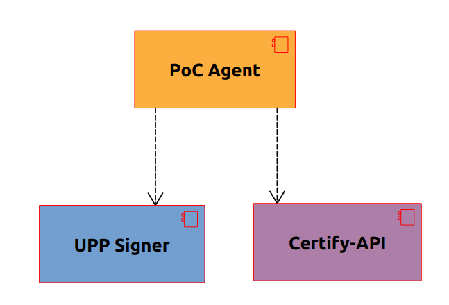

# Ubirch PoC Agent

The PoC Agent stands for `Point of Certification Agent`. Its task is to enable an on-premise solution that allows creating Ubirch UPP Certificates and DCC Test Certificates.

The PoC Agent can be thought of as a facade system. It handles the incoming certification requests and has the ability to coordinate them and distribute them to the target systems in order to generate a upp-dcc certificate. There are two target systems in the PoC Agent. One is the _UPP Signer_; and the other is the _Certify-API_. The former is in charge of realizing the creation, signing of the UPP and its registration on the _Ubirch Trust Service_. The latter is in charge of validating and issuing a digital covid certificate. 

A _upp-dcc certificate_ is a certificate that holds both the dcc and upp information. They are connected in a way such that the dcc data fields are mapped into a alternative data structure that is understood by the Ubirch Trust Service. Both generations must be successful in order for the system to provide a upp-dcc certificate.

# Let's get started

In order to get working with the system, we present a description of the API. What its endpoints are and what kind of data is expected or returned. Then we present a description of what is required to send out request in terms of the identity configuration. Finally, we present two options for getting to work with the system; we offer a how-to get around from sources; and another how-to to simply start using the system without compiling or installing toolchains.

1. [Interface Procurement](./docs/interface_description.md)
2. [Identity Configuration](./docs/identity_procurement.md)
3. [Working From Code](./docs/working_from_code.md)
4. [Working From Docker-Compose](./docs/working_from_docker_compose.md)
