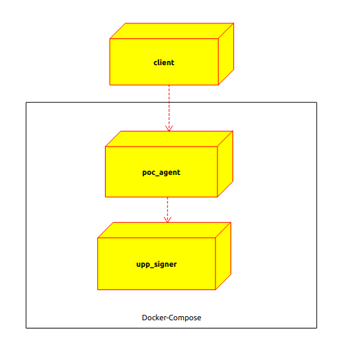
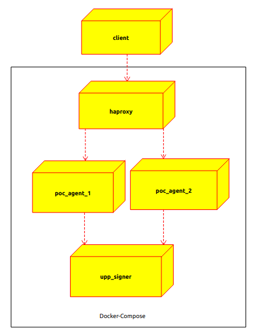

# Working from Docker Compose

1. [Requirements](#requirements)
2. [Docker Images](#docker-images)  
3. [Docker Compose Flavors](#docker-compose-flavors)
4. [Single PoC Agent](#single-poc-agent)
5. [Load Balanced PoC Agent](#load-balanced-poc-agent)
6. [Verify](#verify-that-it-has-started)
7. [Create a Certificate](#create-a-certificate)

## Requirements

- Docker
- docker-compose

## Docker Images

### Poc Agent

For the ` PoC Agent`, you can create an image by running from the root folder of the project: 

```shell
mvn clean package -Dbuild.number=<BUILD_NUMBER>
```

Where <BUILD_NUMBER> is the tag of your image, for example: poc_agent_test.

### UPP Signer

The versions of the UPP Signer greater than v1.2.2 changed the storage mechanism to being a postgresql database. For the current configuration, we recommend the version tag v1.2.2.  

## Docker Compose Flavors

We offer a quick start to start using the system. The repository has two docker compose definitions that can offer a nice and controlled environment.

There are two flavors:

- [Single PoC Agent](#single-poc-agent): One  to one configuration. One PoC Agent and one UPP Signer.
- [Load Balanced PoC Agent](#load-balanced-poc-agent): HA Proxy, two PoC Agents and one UPP Signer.

In order to facilitate the process, a deployment-ready folder is provided. This folder is 'deploymentComponents'


## Single PoC Agent

> - A key store is expected to be located at: 'deploymentComponent/pocAgent'
> - A key store password configured in 'deploymentComponent/poc_agent.env'
> 
> - A configured config.json for the UPP Signer is expected at 'deploymentComponent/uppClient'

> If you don't have a keystore yet. Check out [Identity Procurement](./identity_procurement.md).



```shell
docker-compose --f docker-compose.yml up -d
```

The flag (-d) starts the systems in detached mode. If you have run it with this flag, you can use the following command to see the logs.

```shell
docker-compose logs -f
```

## Load Balanced PoC Agent

> - A key store is expected to be located at: 'deploymentComponent/pocAgent'
> 
> - A key store password configured in 'deploymentComponent/poc_agent.env'
>
> - A configured config.json for the UPP Signer is expected at 'deploymentComponent/uppClient'

> If you don't have a keystore yet. Check out [Identity Procurement](./identity_procurement.md).

This configuration allows to have a load balancer in place for the poc-agent system. The instances of the poc-agent system are deployed. The default configuration is round-robin. If you send a request, the logs should show the name of the poc_agent_1 and if you send another one, the poc_agent_2 will be shown instead. This is simple but powerful configuration.



```shell
docker-compose --f docker-compose-load-balancer.yml up -d
```

The flag (-d) starts the systems in detached mode. If you have run it with this flag, you can use the following command to see the logs.

```shell
docker-compose logs -f
```

## Verify that it has started

If you started the application on port 8081:

```shell
curl -L http://localhost:8081
```

You should get a hello message:

```json
{
  "version": "0.1.0",
  "ok": true,
  "data": "Hallo, Hola, こんにちは, Hello, Salut, Hej, this is the Ubirch Point of Certification agent."
}
```

## Create a Certificate

Open op this file: [Test Example](../deploymentComponents/create_test.sh) and replace deviceId and devicePwd and in the data object the id field with you unique identifier as integrator.


